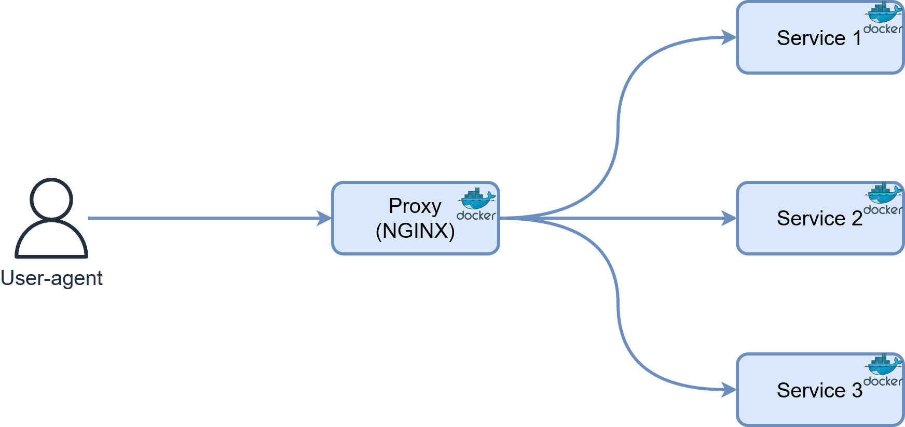

# Authentication methods with a reverse proxy

This repository contains code examples of different means of authentication when multiples apps are behind a reverse-proxy.

It is meant to illustrate my [blog post on authentication behind a proxy]() and assumes no control over the source code of the upstream apps.

## Running the examples

Make sure that all the subdomains (`*.localhost`) redirects to the nginx server ip!
Every `*.localhost` URL shoud send you to 127.0.0.1 by default but you may need to modify your /etc/hosts file to make this work.

Cache issues may arise between examples. If you enconter problem, clean your cache or try in a private browsing window.

* **App-based authentication**
    * [No authentication](./app-no-auth)
    * [Internal authentication](./app-internal-auth)
    * [OpenID Connect authentication](./app-oauth-auth)
* **Proxy-based authentication**
    * [Basic authentication](./proxy-basic-auth)
    * [HTTP header authentication](./proxy-header-auth)
    * [Auth request authentication](./proxy-auth-request)